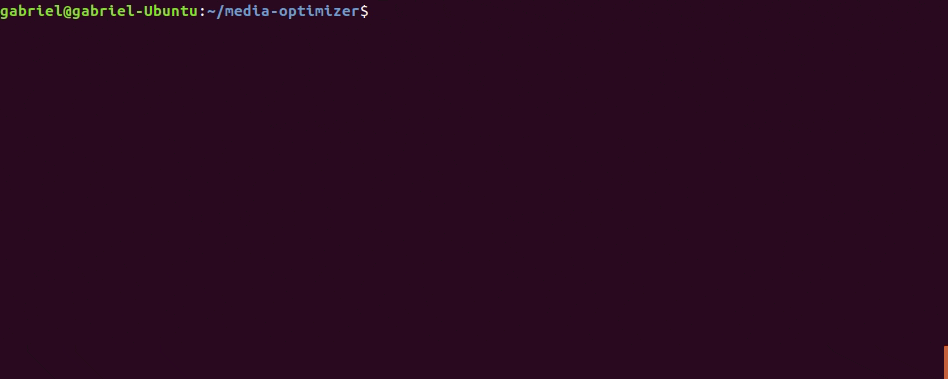
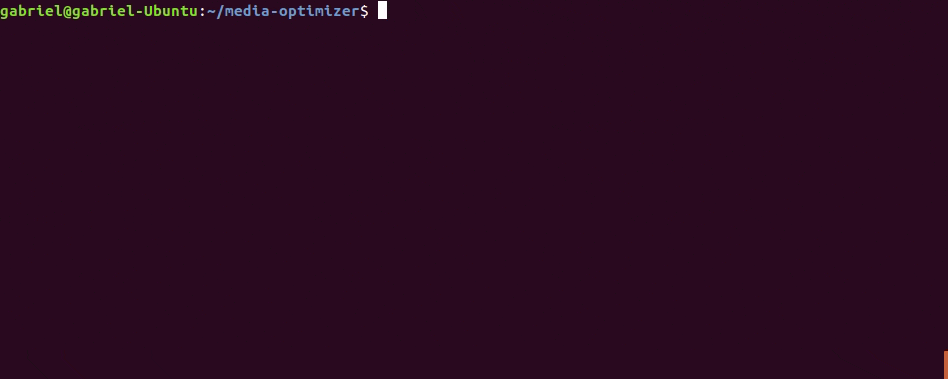
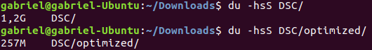
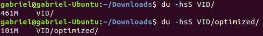

# Media Optimizer v0.3.0
A simple **CLI tool** designed to **optimize different media files** *(pictures and videos)* through a user-friendly interface, with keyboard-navigable menus, progress bars and extensive options to tweak its behavior and output quality.

**For pictures:**<br/>


**For videos:**<br/>


## Result examples

**For pictures:**
- **Input**: 55 high-quality, 6240x4160 JPEG pictures taken with a DSLR camera, totalling **1.17 GiB**.
- **Options**: size=original, format=original, quality=80
- **Output**: **256.57 MiB** *(78.5% less)*



**For videos:**<br/>
- **Input**: 2 high-quality, 3840x2160 MPEG-4/H.264 videos recorded with a smartphone, totalling **460.37 MiB**
- **Options**: size=original, quality=22 *(no noticeable difference)*, preset=medium
- **Output**: **100.47 MiB** *(78.2% less)*



# Dependencies
Python dependencies are managed by the project, so you just need to follow the instructions below to use the tool.

However, there are some external dependencies that you will need to install manually for your system:
- Required only for video optimization:
    - [**FFmpeg**](https://www.ffmpeg.org) *(>= 6.0)*
    - **x265** encoder *(FFmpeg distributable might include it)*

# Instructions

> [!WARNING]
> I created this tool to reduce the size of pictures and videos, saving space for **storage in cloud services** and **regular display usage**, where high-accuracy data and ultrafine detail are not necessary.
>
> Therefore, in most cases, **lossy compression** is used for these kinds of files.
>
> If you want to optimize your pictures and videos for the same reason as I do, go ahead and use this tool. If, on the contrary, you need to retain high-detail data for editing, publishing or similar usages, using this tool to reduce the size of the source material is highly discouraged.

## For regular usage
### Downloading distributable version
Currently, the recommended and most convenient way of using Media Optimizer is by **downloading** the **distributable version**.

You can find the latest version in the [releases section](https://github.com/gabrielrf96/media-optimizer/releases). Make sure to choose the correct version for your OS. If you can't find a version for your specific OS or system architecture, no worries: you can build the distributable version yourself from the source code *(see next section)*.

The distributable version is a **portable executable**, so you can use it directly from your terminal. For convenience, you might want to put the executable in a directory that is included in your `PATH`, which will allow you to run Media Optimizer without having to navigate to the directory that contains the executable.

### <a name="building-from-source"></a>Building from source
If you prefer, you can build the distributable version yourself from the source code:

1. **Install** the **project manager**, `uv`: [astral-sh/uv](https://github.com/astral-sh/uv)

2. **Clone** the repository and install the necessary dependencies.
    ```sh
    git clone https://github.com/gabrielrf96/media-optimizer.git
    cd media-optimizer
    uv sync
    ```

    2.1. <a name="build-from-source-macos"></a>If you're on an Apple Silicon Mac, make sure `uv sync` has installed an arm64 version of Python in the virtualenv. That should be the case, but if you have an x86_64 version installed that matches the required version, uv might try to use that instead:
    ```sh
    file .venv/bin/python
    # The result should be something similar to:
    # .venv/bin/python: Mach-O 64-bit executable arm64

    # If it's not, you can try re-syncing with the
    # --managed-python flag:
    rm -rf .venv
    uv sync --managed-python
    ```

3. **Run the build command**:
    ```sh
    uv run devtools.py build
    ```

    Once the build command finishes, you will be able to find the ready-to-use executable in the `dist/` directory.

### Running from source
If you don't like running executables, there is also the less convenient but equally functional possibility of running Media Optimizer directly from the source:

1. **Install** the **project manager**, `uv`: [astral-sh/uv](https://github.com/astral-sh/uv)

2. **Clone** the repository and install the necessary dependencies.
    ```sh
    git clone https://github.com/gabrielrf96/media-optimizer.git
    cd media-optimizer
    uv sync --no-dev
    ```

    2.1. If you're on an Apple Silicon Mac, check out [step 2.1.](#build-from-source-macos) of the ["Building from source"](#building-from-source) section to make sure you're building an arm64 executable.

3. **Run the tool**:
    ```sh
    uv run media_optimizer.py
    ```

    Done! The result is the same as running the distributable version.

## For development

### Setting up the project
1. **Install** the **project manager**, `uv`: [astral-sh/uv](https://github.com/astral-sh/uv)

2. **Clone** the repository and install the necessary dependencies.
    ```sh
    git clone https://github.com/gabrielrf96/media-optimizer.git
    cd media-optimizer
    uv sync
    ```

3. **Set your IDE's Python interpreter** to the one inside the project's venv: `.venv/bin/python` or `.venv/Scripts/python` *(on Windows)*

    If you're using Visual Studio Code, you can just use the included example settings file, which also provide some other useful default settings for the workspace:

    ```sh
    cd .vscode
    cp settings.example.json settings.json

    # If you're on Windows, use the Windows example JSON settings file instead:
    copy settings.example.win.json settings.json
    ```

### Recommended Visual Studio Code extensions
- **Python** *(Microsoft)*
- **Pylint** *(Microsoft)*
- **Black Formatter** *(Microsoft)*
- **isort** *(Microsoft)*

### General guidelines
- Changes should always be worked on in **feature branches**, and merged to master only when they are stable or prepared for a new release.
- Commit history in feature branches should be kept when it is deemed valuable. Therefore, an effort should be made to keep commit history clean in feature branches.
- For minor features or hotfixes, commits may be squashed if keeping the entire history does not seem valuable.
- While a feature branch is not yet public, interactive rebase may be used to tidy up commit history before publishing the branch.

### Bumping version
1. Bump the version using the project's devtools command:
    ```sh
    # Bump MAJOR version
    uv run devtools.py version -b  # or --bump-major

    # Bump MINOR version
    uv run devtools.py version -m  # or --bump-minor

    # Bump PATCH version
    uv run devtools.py version -p  # or --bump-patch
    ```

2. Create a new git tag with the corresponding version, following the format `vX.Y.Z`, where:
    - `X` = major
    - `Y` = minor
    - `Z` = patch

3. Push the changes and the new tag.

### Releasing a new version
1. **Bump the version** by following the instructions from the previous section. Choose the correct bump type *(major, minor or patch)* depending on the nature of the changes you are introducing.

2. **Merge the changes into master and push them**, making sure you first update your branch with any changes that may have been developed there *(by either merging master into your branch, or rebasing onto main if your branch is not public yet)*.

    If your branch is for a hotfix or minor feature, consider squashing your commits if keeping the full history does not seem valuable.

3. **Build the executables** in release mode, for all supported platforms:
    ```sh
    uv run devtools.py build -r  # or --release

    # Repeat for Windows, Linux, Mac OS (Intel and Apple Silicon)
    ```

    3.1. When building release-ready distributables on an Apple Silicon Mac, both the x86_64 and arm64 versions should be built. If that is not happening, check out [step 2.1.](#build-from-source-macos) of the ["Building from source"](#building-from-source) section.

4. **Create a new release on GitHub** and attach the zip files generated in the previous step. Include a reasonably detailed changelog in the release description.

# Third-party tools
Media Optimizer relies on some third-party tools to provide its functionality.

This project is possible thanks to the developers and maintainers of those tools.

## Bundled third-party tools
Distributable versions of Media Optimizer are bundled with binaries of the following third-party tools, and include a copy of their licenses for reference and attribution, complying with the legal requirements of said licenses:

- [MediaInfo](https://mediaarea.net/en/MediaInfo/License)

## External third-party tools
Media Optimizer requires some external dependencies to be installed on your system in order to function properly, as stated in the "Dependencies" section:

- [FFmpeg](https://www.ffmpeg.org/)
- [x265 encoder](https://x265.com/about/) *(bundled with FFmpeg)*


# Bug reporting and contact
If you experience any kind of trouble while using this tool, please feel free to contact me to report any bugs or problems.

You can contact me by:

- Opening an <a href="https://github.com/gabrielrf96/media-optimizer/issues">**issue on GitHub**</a>
- Sending me an e-mail at <a href="mailto:contact@gabrielrf.dev">**contact@gabrielrf.dev**</a>

<br/>
<br/>
<p align="center">
    Made by Gabriel Rodríguez
    <br/>
    <a href="https://www.gabrielrf.dev">www.gabrielrf.dev</a>
</p>
