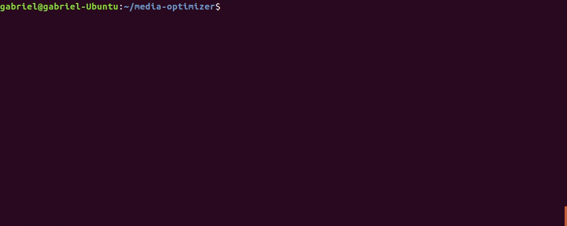
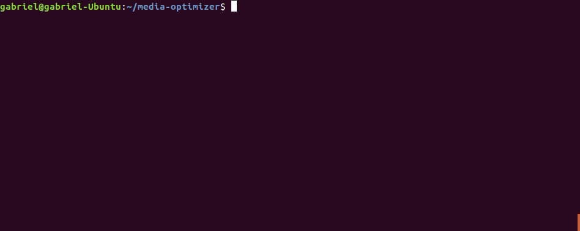
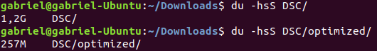
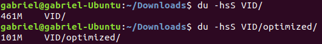

# Media Optimizer v0.3.0
A simple **CLI tool** designed to **optimize different media files** *(pictures and videos)* through a user-friendly interface, with keyboard-navigable menus, progress bars and extensive options to tweak its behavior and output quality.

**For pictures:**<br/>


**For videos:**<br/>


## Result examples

**For pictures:**
- **Input**: 55 high-quality, 6240x4160 JPEG pictures taken with a DSLR camera, totalling **1.17 GiB**.
- **Options**: size=original, format=original, quality=80
- **Output**: **256.57 MiB** *(78.5% less)*



**For videos:**<br/>
- **Input**: 2 high-quality, 3840x2160 MPEG-4/H.264 videos recorded with a smartphone, totalling **460.37 MiB**
- **Options**: size=original, quality=22 *(no noticeable difference)*, preset=medium
- **Output**: **100.47 MiB** *(78.2% less)*



# Dependencies
Python dependencies are managed by the project, so you just need to follow the instructions below to use the tool.

However, there are some external dependencies that you will need to install manually for your system:
- Required only for video optimization:
    - [**FFmpeg**](https://www.ffmpeg.org) *(>= 6.0)*
    - **x265** encoder *(FFmpeg distributable might include it)*

# Instructions

> [!WARNING]
> I created this tool to reduce the size of pictures and videos, saving space for **storage in cloud services** and **regular display usage**, where high-accuracy data and ultrafine detail are not necessary.
>
> Therefore, in most cases, **lossy compression** is used for these kinds of files.
>
> If you want to optimize your pictures and videos for the same reason as I do, go ahead and use this tool. If, on the contrary, you need to retain high-detail data for editing, publishing or similar usages, using this tool to reduce the size of the source material is highly discouraged.

## For regular usage
### Downloading distributable version
Currently, the recommended and most convenient way of using Media Optimizer is by **downloading** the **distributable version**.

You can find the latest version in the [releases section](https://github.com/gabrielrf96/media-optimizer/releases). Make sure to choose the correct version for your OS. If you can't find a version for your specific OS or system architecture, no worries: you can build the distributable version yourself from the source code *(see next section)*.

The distributable version is a **portable executable**, so you can use it directly from your terminal. For convenience, you might want to put the executable in a directory that is included in your `PATH`, which will allow you to run Media Optimizer without having to navigate to the directory that contains the executable.

> [!WARNING]
> Distributable versions are experimental. If you experience any issues while using them, please report them in the [issues section](https://github.com/gabrielrf96/media-optimizer/issues).
>
> In that case, it also adviced that you opt for building the executable from source in your own machine, which will most likely fix those issues.

### Building from source
If you prefer, you can build the distributable version yourself from the source code:

1. **Install** the **project manager**, `uv`: [astral-sh/uv](https://github.com/astral-sh/uv)

2. **Clone** the repository and install the necessary dependencies.
    ```sh
    git clone https://github.com/gabrielrf96/media-optimizer.git
    cd media-optimizer
    uv sync
    ```

    2.1. <a name="build-from-source-macos"></a>If you're on an Apple Silicon Mac, make sure `uv sync` has installed an arm64 version of Python in the virtualenv. That should be the case, but if you have an x86_64 version installed that matches the required version, uv might try to use that instead:
    ```sh
    file .venv/bin/python
    # The result should be something similar to:
    # .venv/bin/python: Mach-O 64-bit executable arm64

    # If it's not, you can try re-syncing with the
    # --managed-python flag:
    rm -rf .venv
    uv sync --managed-python
    ```

3. **Run the build command**:
    ```sh
    uv run devtools.py build
    ```

    Once the build command finishes, you will be able to find the ready-to-use executable in the `dist/` directory.

### Running from source
If you don't like running executables, there is also the less convenient but equally functional possibility of running Media Optimizer directly from the source:

1. **Install** the **project manager**, `uv`: [astral-sh/uv](https://github.com/astral-sh/uv)

2. **Clone** the repository and install the necessary dependencies.
    ```sh
    git clone https://github.com/gabrielrf96/media-optimizer.git
    cd media-optimizer
    uv sync --no-dev
    ```

    2.1. If you're on an Apple Silicon Mac, check out [step 2.1.](#build-from-source-macos) of the ["Building from source"](#building-from-source) section to make sure you're building an arm64 executable.

3. **Run the tool**:
    ```sh
    uv run media_optimizer.py
    ```

    Done! The result is the same as running the distributable version.

## For development
Check out the specific instructions in the [development guidelines document](DEVELOPMENT.md).

# Third-party tools
Media Optimizer relies on some third-party tools to provide its functionality.

This project is possible thanks to the developers and maintainers of all those dependencies.

## Bundled third-party tools
Distributable versions of Media Optimizer are bundled with binaries of some third-party tools, and include a copy of all their licenses for reference and attribution, complying with the legal requirements of said licenses.

## External third-party tools
Media Optimizer requires some external dependencies to be installed on your system in order to function properly, as stated in the "Dependencies" section:

- [FFmpeg](https://www.ffmpeg.org/)
- [x265 encoder](https://x265.com/about/) *(bundled with FFmpeg)*


# Bug reporting and contact
If you experience any kind of trouble while using this tool, please feel free to report any bugs or problems by [opening an **issue**](https://github.com/gabrielrf96/media-optimizer/issues).

<br/>
<br/>
<p align="center">
    Made by Gabriel Rodríguez
    <br/>
    <a href="https://www.gabrielrf.dev">www.gabrielrf.dev</a>
</p>
